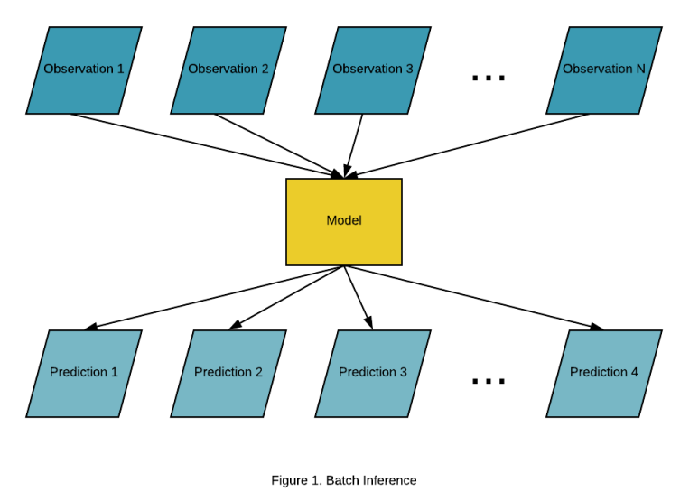
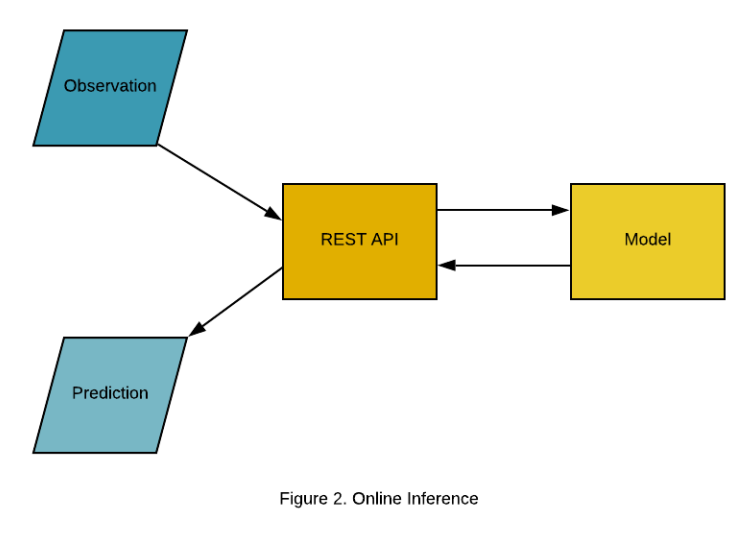
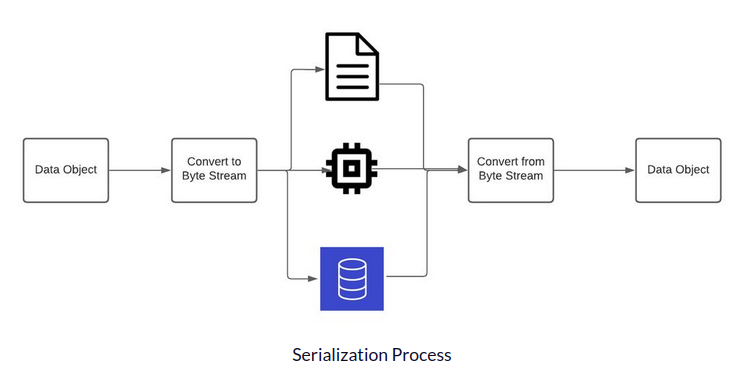

>- This app is to put machine learning models into production with some notes or explanations
- It’s a simple view as it is needed to take into account many more aspects such as the network, security, monitoring, infrastructure, orchestration or adding a database to store the data instead of using a json file.

- The train.py is a python script that ingest and normalize EEG data and train two models(Linear Discriminant Analysis and Multi-layer Perceptron Neural Network models) to classify the data. The Dockerfile will be used to build our Docker image, requirements.txt (flask, flask-restful, joblib) is for the Python dependencies and api.py is the script that will be called to perform the online inference using REST APIs. train.csv are the data used to train our models, and test.json is a file containing new EEG data(1300 rows of EEG data with 160 features) that will be used with our inference models.
- Electroencephalogram (EEG) is a recording of brain activity. During a painless test, small sensors are attached to the scalp to pick up the electrical signals produced by the brain.

- The first step in building APIs is to think about the data we want to handle, how we want to handle it and what output we want with our APIs.
   - There are 3 routes using the open source web microframework Flask.

- Dockerfile with the jupyter/scipy-notebook image is needed as our base image. 
- To build this image, run the following command:
   >- docker build -t my-docker-api -f Dockerfile .
- Now, it is the time to run the online inference which means each time a client issues a POST request to the /line/<Line>, /prediction/<Line>, /score endpoints,it will be shown the requested data (row), predicted the class of the data injected to the pre-trained models, and shown the score of the pre-trained models using all the available data.
- To launch the web server, to run a Docker container and run the api.py script:
   >- docker run -it -p 5000:5000 my-docker-api python3 api.py
    - The -p flag exposes port 5000 in the container to port 5000 on the host machine(Port forward), -it flag allows users to see the logs from the container.
- Now,use the web browser or the curl command to issue a POST request to the IP address http://0.0.0.0:5000/ 
   >- curl http://0.0.0.0:5000/line/232
   >- curl http://0.0.0.0:5000/prediction/232
   >- curl http://0.0.0.0:5000/score

#### Notes:
- Batch inference, or offline inference, is the process of generating predictions on a batch of observations
- Online Inference is the process of generating machine learning predictions in real time upon request. It is also known as real time inference or dynamic inference. Typically, these predictions are generated on a single observation of data at runtime.
- 
- 
 - images taken from[mlinproduction.com](https://mlinproduction.com/batch-inference-vs-online-inference/)
 - Many applications would not work or would not be very useful without online predictions such as autonomous vehicles, fraud detection, high-frequency trading, applications based on localization data, object recognition and tracking or brain computer interfaces. Sometimes, the prediction needs to be provided in milliseconds.

 - <b>Joblib</b> is a Python library for running computationally intensive tasks in parallel. It provides a set of functions for performing operations in parallel on large data sets and for caching the results of computationally expensive functions. If you are working with large NumPy arrays or related objects and need to optimize performance and memory usage, joblib may be a better choice. - If you need more general-purpose serialization capabilities or compatibility with custom objects and classes, <b>pickle</b> may be a better choice. Pickle is unsafe because it can execute malicious Python callables to construct objects. When deserializing an object, Pickle cannot tell the difference between a malicious callable and a non-malicious one. Due to this, users can end up executing arbitrary code during deserialization.
 - Serialization is the process of changing data into a form that can be stored or sent and put back into its original form later.
 - The transmitter handles the encoding of data and serialization for transmission. The process is called “serialization” because it implies that all the information in the object can be sent over a wire one bit at a time in a serial fashion (1 bit after another.)
 - 
 - The image is taken from [freecodecamp](https://www.freecodecamp.org/news/what-is-serialization/)

 

  
#### Reference [towardsdatascience](https://towardsdatascience.com/machine-learning-prediction-in-real-time-using-docker-and-python-rest-apis-with-flask-4235aa2395eb)
